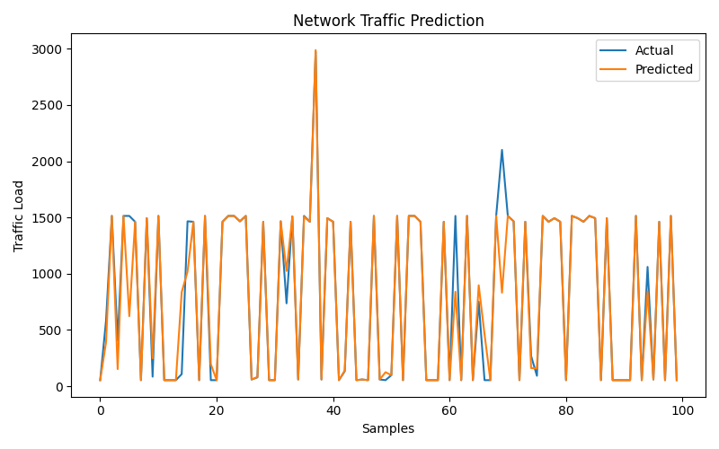

# AI Network Traffic Prediction and Resource Optimization

## Problem Statement

Modern communication networks generate large volumes of dynamic traffic, where sudden spikes in load can lead to:

- Network congestion
- Increased latency
- Packet loss
- Degraded user experience

Traditional network management systems are largely reactive, meaning resources are allocated after congestion occurs.

This project addresses the need for:

A proactive, intelligent system capable of predicting network traffic and optimizing resource allocation in advance.

---

## Proposed Solution

This project presents a Machine Learning-based Network Traffic Optimization Framework that:

- Predicts network traffic load using historical packet-level data
- Applies rule-based decision logic to simulate dynamic resource allocation
- Enables proactive network management

---

## Dataset Description

The dataset consists of real network packet-level information:

| Feature | Description |
|---|---|
| Time | Timestamp of packet |
| Source | Source IP / device |
| No. | Packet number |
| Destination | Destination IP |
| Protocol | Communication protocol (ARP, NBNS, etc.) |
| Length | Packet size (Target Variable) |
| Info | Raw packet description |

Example:

```
Time     Source            Destination        Protocol   Length
0        192.167.8.166     192.167.255.255    NBNS       92
0.7846   192.167.8.166     192.167.255.255    NBNS       92
1.1690   VMware_8a:5c:e6   Broadcast          ARP        60
```

---

## Methodology

### 1. Data Preprocessing

Encoded categorical features:

- Source
- Destination
- Protocol

Removed non-numeric fields:

- Info (text-based packet description)

Defined:

- Target Variable = Length (Network Traffic Load)

### 2. Model Training

A Random Forest Regressor is used to learn traffic patterns.

**Why Random Forest?**

- Handles tabular data effectively
- Captures non-linear relationships
- Robust against noise
- Provides reliable baseline performance

### 3. Traffic Prediction

The trained model predicts future network load values, enabling:

Early detection of traffic spikes and potential congestion.

### 4. Resource Allocation Strategy

A rule-based system translates predictions into network actions:

```
LOW Load     → Normal Routing
MEDIUM Load  → Moderate Scaling
HIGH Load    → Increase Bandwidth
```

This simulates real-world systems such as:

- Software Defined Networks (SDN)
- Cloud Auto-Scaling Systems
- Intelligent Traffic Engineering

---

## Results

### Traffic Prediction


The model successfully learns traffic patterns and produces predictions closely aligned with actual values.

### Resource Allocation Output

```
Prediction 0: LOW → Normal Routing
Prediction 1: MEDIUM → Moderate Scaling
Prediction 2: HIGH → Increase Bandwidth
...
```

---

## Key Insights

- The model effectively captures fluctuations in network traffic
- Traffic load can be predicted with reasonable accuracy
- Simple decision rules can simulate real-world optimization strategies

---

## Real-World Applications

This system can be applied to:

- Cloud infrastructure scaling
- Telecom network optimization
- Data center traffic management
- Smart city communication systems
- IoT network resource allocation

---

## How to Run the Project

### 1. Clone Repository

```bash
git clone https://github.com/syedirfanx/ai-network-traffic-optimization.git
cd ai-network-traffic-optimization
```

### 2. Install Dependencies

```bash
py -m pip install -r requirements.txt
```

### 3. Add Dataset

Place dataset in:

```
data/packets.csv
```

### 4. Run Application

```bash
py app.py
```

---

## Outputs

After execution:

```
results/
├── prediction_vs_actual.png
└── allocation_output.txt

models/
└── model.pkl
```

---

## Research Relevance

This project aligns with:

- Intelligent Communication Networks
- Network Optimization
- AI for Systems Engineering
- Machine Learning in Infrastructure
- Resource Allocation in Distributed Systems

---

## Conclusion

This project demonstrates that:

Machine learning can be effectively applied to predict network traffic and enable proactive resource allocation.

It provides a foundation for:

- Intelligent network control systems
- Autonomous infrastructure optimization
- AI-driven communication networks

---

## Future Work

- Time-series modeling (LSTM / GRU)
- Real-time streaming data integration
- Reinforcement Learning for adaptive allocation
- Cost-aware optimization strategies
- Integration with SDN controllers
