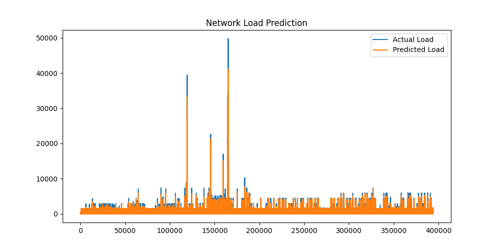

# AI Network Flow Prediction and Resource Optimization

## 1. Problem Statement

Modern communication networks (including 5G, cloud systems, and SDN-based infrastructures) generate highly dynamic and unpredictable traffic patterns due to continuous data exchange between multiple sources and destinations.

Traditional network systems are largely reactive, meaning they respond only after congestion occurs. This leads to:

- Increased latency
- Packet loss
- Inefficient bandwidth utilization
- Poor Quality of Service (QoS)

Therefore, there is a strong need for an intelligent system that can:

Predict future network traffic and proactively allocate resources before congestion occurs.

---

## 2. Solution Overview

This project proposes a machine learning-based network intelligence framework that performs:

### Step 1: Network Flow Analysis

The system processes real packet-level data containing:

- Time
- Source
- Destination
- Protocol
- Packet Number
- Packet Length (Network Load Indicator)
- Information field

These features represent real-world network communication behavior.

### Step 2: Traffic Prediction (Machine Learning Model)

A supervised machine learning model (Random Forest Regressor) is trained to predict network load (packet length) based on historical network flow patterns.

This allows the system to estimate future network congestion levels.

### Step 3: Intelligent Resource Allocation

Based on predicted network load, the system applies a rule-based decision engine:

- LOW Load → Normal routing (minimal resources)
- MEDIUM Load → Moderate scaling of resources
- HIGH Load → Increased bandwidth allocation and rerouting simulation

This simulates a simplified SDN-inspired dynamic resource allocation system.

### Step 4: Visualization & Evaluation

The system compares:

- Actual network load
- Predicted network load

to evaluate model performance and pattern alignment.

---

## 3. Results and Interpretation

The model output demonstrates:

### Prediction Performance

The predicted network load closely follows actual traffic patterns, indicating that the model successfully captures temporal and structural dependencies in the dataset.

### Visualization Insight



The generated graph shows:

- Blue line → Actual network load
- Orange line → Predicted network load

This overlap indicates strong predictive capability for network behavior trends.

**Key Observation**

- Periods of high traffic spikes are correctly identified by the model
- Resource allocation decisions adapt based on predicted congestion levels
- The system demonstrates early-stage capability of proactive network optimization

---

## 4. Research Significance

This project aligns with key research domains:

- Software Defined Networking (SDN)
- Network Traffic Engineering
- AI-driven Resource Allocation
- Intelligent Communication Systems
- Predictive Network Optimization

It demonstrates how machine learning can be used to transition from reactive networking systems to proactive intelligent networks.

---

## 5. How to Run the Project

### Step 1: Clone Repository

```bash
git clone https://github.com/syedirfanx/ai-network-flow-optimization.git
cd ai-network-flow-optimization
```

### Step 2: Install Dependencies

```bash
py -m pip install -r requirements.txt
```

### Step 3: Run the Application

```bash
py app.py
```

### Step 4: View Results

After execution, the system will:

- Print predicted load and allocation decisions in terminal
- Save output dataset in `/results/output.csv`
- Generate visualization graph showing prediction vs actual traffic

---

## 6. Example Output Explanation

Example output:

```
Time | Length | Predicted Load | Allocation
--------------------------------------------
0    | 92     | 92.0           | LOW → Normal Routing
1    | 60     | 60.0           | LOW → Normal Routing
```

**Interpretation:**

- The model predicts network load accurately at each time step
- Low traffic values result in normal routing decisions
- This demonstrates adaptive decision-making based on AI predictions

---

## 7. Future Improvements

- Integration of LSTM-based deep learning for improved temporal prediction
- Real-time streaming data integration
- Reinforcement learning-based SDN controller simulation
- Deployment as a live network monitoring dashboard

---

## Final Conclusion

This project demonstrates a complete pipeline for:

Predicting network traffic and simulating intelligent resource allocation using machine learning techniques.

It serves as a foundational step toward developing AI-driven autonomous communication networks.
